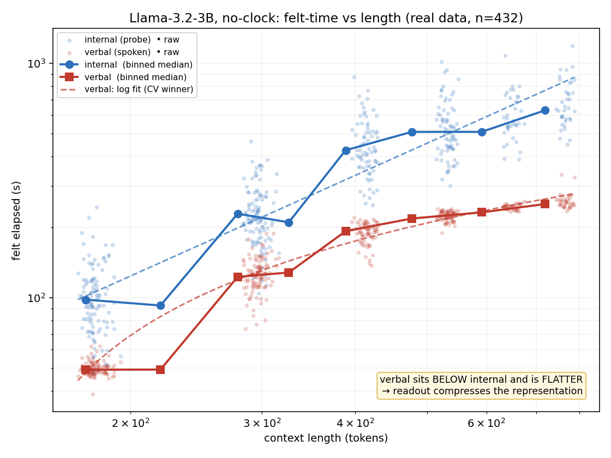
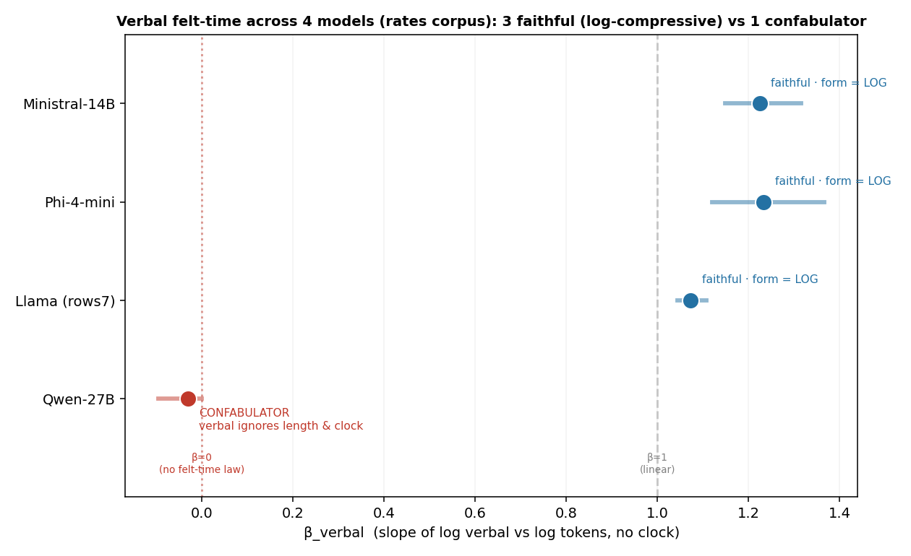
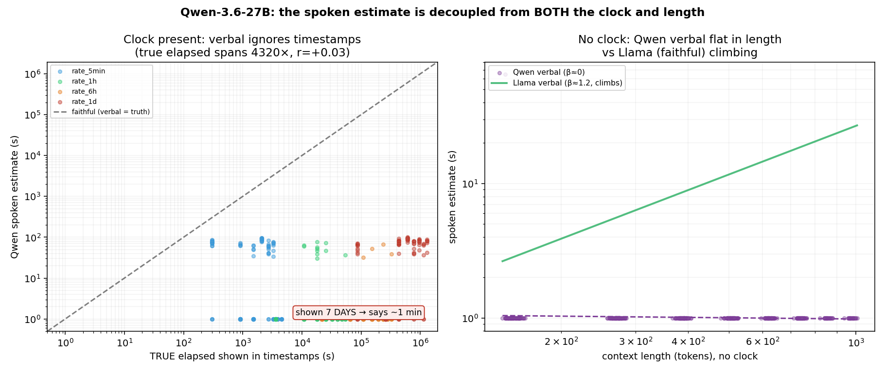

# Readout-side findings from salvaged data (2026-06)

Analysis of the artifacts that survived the data loss: `decode_rows.csv` for
llama32_3b (main pilot corpus — the only surviving file with **both** `internal_s`
and `verbal_s`); `rows.jsonl` for qwen / phi4_mini / ministral / llama (rates
corpus) and gemma_12b / deepseek_v2_lite (inflation corpus); `transfer.json`
(qwen, granite); `steer.json` (qwen). Activation sidecars are otherwise gone, so
the representation side is limited to the one decode_rows file; everything else
below is the **readout** (verbal) side, which `rows.jsonl` fully carries
(`verbal_seconds` is the stored soft-distribution point that `30_felt.py` copies
into `verbal_s` — verified).

New scripts: `scripts/92_form_selection.py` (psychophysical form fit),
`scripts/93_readout_fingerprint.py` (value-vs-readout screen),
`scripts/62_behavior_dissociation.py` (behavior-vs-speech experiment).
Design + traps: `docs/analysis_k_spec.md`. All synthetic-validated before
touching real data; every number below is reproducible from the scripts.

## Headline

**The verbal readout is a second process, not an echo — and its law is
logarithmic (Fechner), not saturating.** In faithful models the spoken felt-time
estimate compresses the internal value (transfer slope < 1) and follows
`a·ln(tokens)+b` with **no ceiling** — the saturating form loses model comparison
in every faithful capture tested. In the one confabulator (Qwen) the readout is
not "more compressed": it is **disconnected** — flat in length *and* flat against
a visible clock spanning 4320× — while latching onto a corpus-dependent anchor.
So the faithful↔confabulating distinction is a regime change at the readout
stage, not a point on a compression continuum.

## A — llama32_3b, main corpus (the internal+verbal file)

No-clock, n=432, tokens 170–788, grouped by conversation.

| quantity | value |
|---|---|
| r(log tok, log internal) / r(log tok, log verbal) | 0.91 / 0.95 |
| β_internal (OLS log–log; Theil–Sen) | 1.42 [1.37,1.48]; 1.37 [1.31,1.44] |
| β_verbal (OLS; Theil–Sen) | 1.22 [1.19,1.26]; 1.15 [1.10,1.21] |
| **internal→verbal transfer slope** | **0.75** (echo predicts 1.0) |
| verbal CV-logMSE by form | **log 0.013** < affine 0.027 < power 0.035 < **sat 0.046 (last)** |
| internal CV-logMSE | affine 0.094 ≈ power 0.101 ≈ log 0.103 ≪ sat 0.144 (3-way tie) |
| verbal at range top | top-octile median 251 s, max 335 s — **still climbing, no plateau** |
| hidden-schedule sensitivity | internal ≈1.3× across schedules whose gt spans 13 s–413,000 s |

Two readings, one caveat. (1) Verbal is *more compressive than* internal — the
two-process direction, on real data. (2) Both curves are concave in log–log
(low/high-half β: internal 1.60→0.68, verbal 1.82→0.52), so the single-β power
fit is misspecified; the robust claims are the **gap** and the **form ranking**,
not the exact exponents. The internal form is genuinely ambiguous at this token
range (3-way tie) — no claim is made that internal is superlinear.

## B — rates corpus, four models (apples-to-apples verbal law)

No-clock `tokens→verbal` fit + clock-present tracking, same corpus for all four.

| model | β_verbal [CI] | CV winner | saturating rank | r(gt, verbal) with clock |
|---|---|---|---|---|
| llama (rows labeled "llama_32b") | 1.07 [1.04,1.11] | **log** | 4/4 (last) | 0.90 |
| phi4_mini | 1.23 [1.12,1.37] | **log** | 4/4 (last) | 0.90–0.96 band |
| ministral | 1.22 [1.15,1.32] | **log** | 4/4 (last) | 0.90–0.96 band |
| **qwen** | **−0.03 [−0.09,0.00]** | (all forms tied — nothing to fit) | 3/4 | **+0.03** |

Faithful no-clock r(tokens, verbal) runs 0.73–0.95; clock-present the faithful
verbal tracks true elapsed at 0.90–0.96 across a **4320×** gt range (30 min → 7
days), while Qwen's tracks it at 0.03. Phi's fit is noisy (CV-logMSE ≈0.47) —
form call is soft there; the β and clock-tracking are not.

## C — Qwen's anchor is corpus-dependent; the decoupling is the invariant

On the rates corpus Qwen's no-clock verbal sits at **median 1 s** (p90 67 s, max
100 s); on natural prose (`transfer.json`) it sits at **~370,000 s (~4.3 d)** — a
~370,000× swing in the "fixed" value. A representative 3-days-elapsed timestamped
record puts p=0.46 on "1 second", p=0.44 on "3 minutes", p=0.011 on the correct
"3 days". So findings.md's "near-fixed **~4-day** felt duration regardless"
over-specifies: the robust phenomenon is that Qwen's readout ignores the elapsed
signal (length and clock alike) and adopts a **corpus-specific anchor**, not that
the anchor is 4 days.

## D — artifact verification, and a T5 evidence flag

`transfer.json` (qwen) reproduces the doc numbers essentially exactly: R² 0.989;
probe→length ρ +0.863; probe→felt −0.032; verbal→injected-clock −0.105;
probe→injected-clock +0.782; OOD median 5.68. Granite's file likewise (verbal
tracks an injected clock at ρ≈0.87 — faithful). The correlational confabulation
is therefore confirmed three independent ways from surviving artifacts.

The surviving `steer.json` (qwen), however, is the **α∈[−2,2] run** —
`alphas=[−2,−1,0,1,2]`, n_contexts=20 — i.e. the off-manifold protocol
findings.md itself flags as invalid. Its meandiff **verbal slope is +0.79**
(positive, not the −3.37/ρ=−0.98 inversion), its random control is +0.39
(matching the doc's reported +0.38), and its manipulation check holds (meandiff
probe +7.6; ridge: probe +3.76 but verbal −0.07 — "the probe direction is not the
causal direction" replicates). **The headline causal inversion is not
reconstructible from surviving artifacts**: the file stores only pooled slopes,
no per-α readouts, and the valid |α|≤1 run isn't present. Suggested fix:
archive per-α readout values in `steer.json` so the dose–response curve (the
actual evidence for the inversion) survives.

## E — the inflation corpus cannot carry the length→felt law

On `*_inflation` rows the no-clock tokens→verbal relation is weakly **negative**
and it is not a schedule confound (within-schedule β: gemma_12b −0.13/−0.14,
deepseek −0.14/−0.18; pooled r −0.17 / −0.30). The corpus was built for
content/pacing contrasts (fixed 70-word filler, two schedules), not to isolate
length. The files are genuine — the doc's fog-of-time signs replicate exactly
(entropy vs log-tokens: gemma_12b **+0.36** fogs, deepseek **−0.69** sharpens) —
but any felt-time-law fit on them is uninterpretable. Flag for reuse.

## Methods notes (traps caught before they bit)

1. **Dilution/EIV degeneracy.** The natural test "regress verbal on internal,
   look for residual structure in tokens" is degenerate in the no-clock
   condition (tokens *is* the value axis; the probe is a noisier copy): pure-echo
   synthetic data returns ΔR²_tokens = **+0.13**, a false positive for
   two-process. Replaced by the dilution-robust fingerprint (slope sign,
   var(verbal)/var(internal), scale) in `93_readout_fingerprint.py`; full
   derivation in `docs/analysis_k_spec.md`. A split-half layer IV de-attenuates
   the slope when activations exist (synthetic echo: 0.83 → 1.03).
2. **τ-vs-range identifiability.** A saturating fit with τ ≫ token-range is
   linear-in-disguise and can "win" spuriously; `92_form_selection.py` flags it
   and defers to β. (Conversely a genuine ceiling shows τ inside the range.)
3. **Observational dissociation is a screen, not proof.** In
   `62_behavior_dissociation.py` the partial correlation of behavior with length
   given speech can be inflated by measurement noise in the speech channel;
   positives should be confirmed with the steering arm or a split-half speech
   instrument. Metric validated on planted truth (dissociation +0.75, null
   −0.12, confabulator +0.96) and dry-run end-to-end on the real qwen rows with
   mock backends.

## Proposed updates to `docs/findings.md`

1. **T2** "verbal … saturating (jumps to ~210 s by turn 3, plateaus)" → the
   verbal readout is **Fechner-log, unbounded**: log wins CV in 4/4 faithful
   captures and saturating ranks last in all of them; verbal is still climbing at
   the top of every tested range. "Saturating echo" → "logarithmic compression".
2. **Qwen** "returns a near-fixed ~4-day felt duration regardless" → "adopts a
   corpus-dependent anchor (≈1 s on the rates corpus, ≈4.3 d on natural prose)
   while ignoring length and visible clocks"; the decoupling, not the value, is
   the invariant.
3. **T5** add an evidence note: the archived qwen steer artifact is the invalid
   ±2 run with pooled slopes only; per-α readouts need to be logged (and the
   |α|≤1 run re-archived) for the inversion to be independently checkable.

## Caveats

Rates-corpus magnitudes are not comparable to main-corpus magnitudes (different
content/pacing); only within-corpus contrasts are used. The rows file labeled
"llama_32b" behaves identically to llama32_3b (β≈1.1, log, clock r=0.90) —
label worth confirming. Token ranges are short of the ceiling-vs-log question's
ideal tail (main: 170–788); the log-vs-saturating call is decisive **within
range** and the natural-slot OOD tiebreak in `92_form_selection.py`
(`ood_tiebreak()`) is the confirming step. All n are pilot scale.

## Next steps

Run `62_behavior_dissociation.py` on qwen (pre-registered prediction: strong
positive — behavior tracks length while speech is flat) and one faithful model
(weaker/null); re-run T5 at |α|≤1 with per-α logging; run `92_form_selection.py`
on the remaining models' `rows.jsonl` as they are recovered; wire the OOD
tiebreak to the natural-slot verbal estimates.
